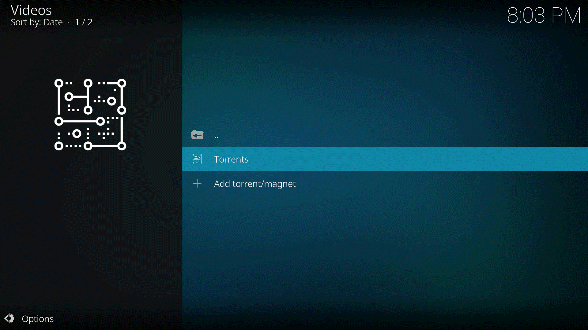

# plugin.video.torrest

Another torrent streaming engine for Kodi. It uses the [torrest service](https://github.com/i96751414/torrest), which
provides an API specially made for streaming.

## Supported platforms

-   Windows 32/64 bits (starting Vista)
-   Linux 32/64 bits
-   Linux ARM (ARMv7 and ARM64)
-   OS X 64 bits
-   Android (5.x and later) ARM, x86 and x64

Minimum supported Kodi version: 16 (Jarvis)

## Installation

The recommended way of installing this addon is through its [repository](https://github.com/i96751414/repository.github#installation).
This way, any updates will be automatically installed.

Although **not recommended**, one can install the addon without installing its repository. To do so, get the
[latest release](https://github.com/i96751414/plugin.video.torrest/releases/latest) from github.
**Do NOT use the `Download ZIP` button on this page.** Please note that, if there are any additional dependencies, they
won't be resolved unless the repository is installed.

## Calling torrest from other addon

One can call torrest from other addons. To do so, simply use torrest API:

|Url|Description|
|---|-----------|
|`plugin://plugin.video.torrest/play_magnet?magnet=<magnet>`|Plays the provided `<magnet>`|
|`plugin://plugin.video.torrest/play_url?url=<url>`|Plays the provided torrent file `<url>`|
|`plugin://plugin.video.torrest/play_path?path=<path>`|Plays the provided torrent file path `<path>`|

## Screenshots

